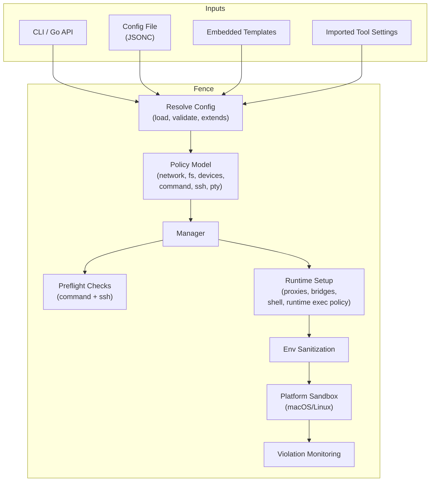
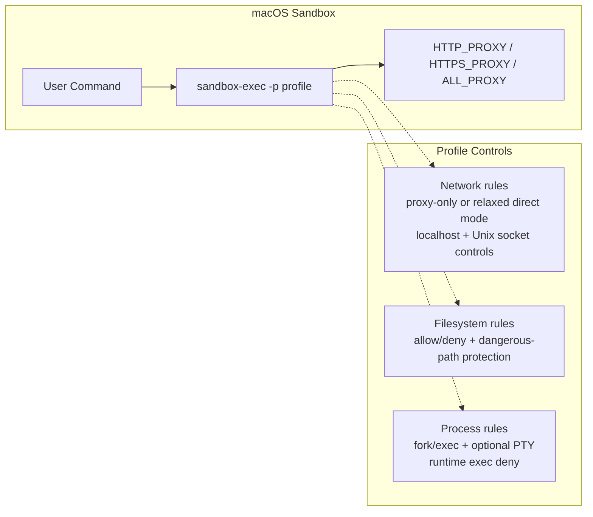
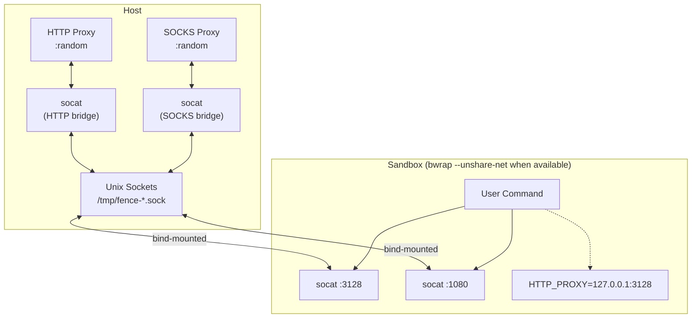
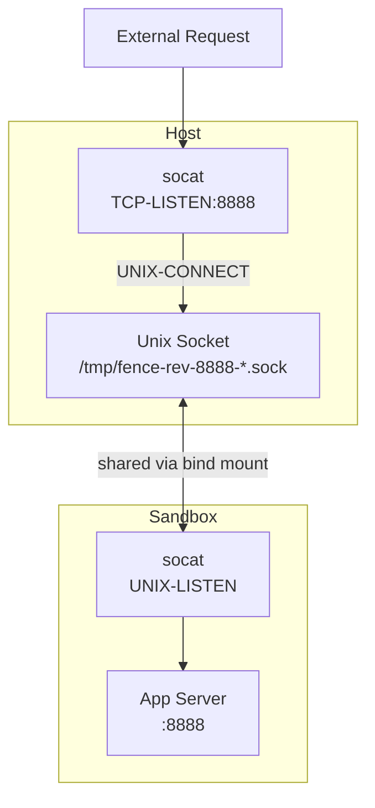
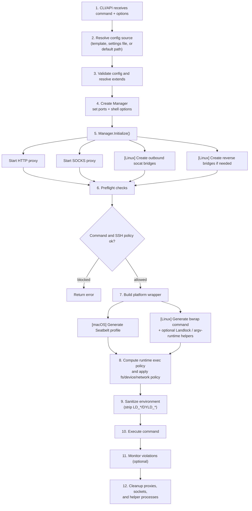

# Architecture

Fence is a policy-driven wrapper for running semi-trusted commands. It does more
than "run a command behind a proxy": the CLI or Go API resolves configuration,
merges templates or imported settings, evaluates policy, starts local
control-plane components, and then delegates enforcement to a platform-specific
sandbox.

At a high level, Fence has four layers:

1. **Configuration resolution** - Load JSONC, templates, imports, and `extends`
2. **Policy evaluation** - Network, filesystem, devices, commands, SSH, and PTY
3. **Runtime orchestration** - Start proxies/bridges, choose shell, harden env
4. **Platform enforcement** - macOS Seatbelt or Linux bubblewrap/Landlock/seccomp



## Project Structure

```text
fence/
├── cmd/fence/                  # CLI entry point and runtime helpers
│   ├── main.go                 # Main CLI, config/import/completion commands, internal helper modes
│   ├── pty_runtime_linux.go    # Linux PTY + signal relay for interactive sessions
│   └── pty_runtime_stub.go     # Non-Linux PTY stub
├── internal/                   # Private implementation
│   ├── config/                 # Config types, loading, validation, file formatting
│   ├── configschema/           # JSON Schema generation
│   ├── importer/               # Import external tool settings into fence config
│   ├── platform/               # OS detection and support helpers
│   ├── proxy/                  # HTTP and SOCKS5 filtering proxies
│   ├── templates/              # Embedded built-in config templates
│   └── sandbox/                # Policy enforcement and platform-specific wrapping
│       ├── manager.go          # Owns proxies, bridges, shell options, cleanup
│       ├── command.go          # Command parsing, deny/allow rules, SSH policy
│       ├── runtime_exec_deny.go # Path-based exec-time blocking for selected denied executables
│       ├── runtime_exec_policy.go # Runtime exec policy selection helpers
│       ├── runtime_exec_argv_linux.go # Linux argv-aware runtime exec supervisor + shim
│       ├── runtime_exec_argv_stub.go # Non-Linux stub for argv-aware runtime exec
│       ├── sanitize.go         # Environment sanitization
│       ├── dangerous.go        # Mandatory dangerous file/directory protection
│       ├── shell.go            # Shell quoting helpers
│       ├── shell_select.go     # Shell selection / validation
│       ├── macos.go            # macOS sandbox-exec profile generation
│       ├── linux.go            # Linux bubblewrap wrapper generation
│       ├── linux_landlock.go   # Landlock filesystem enforcement
│       ├── linux_seccomp.go    # Seccomp BPF generation
│       ├── linux_ebpf.go       # eBPF monitoring
│       ├── linux_features.go   # Kernel/environment feature detection
│       └── monitor.go          # macOS log stream monitoring
├── pkg/fence/                  # Public Go API
├── docs/schema/                # Published JSON schema
└── tools/generate-config-schema/ # Schema generator entry point
```

## Core Layers

### CLI And Public API (`cmd/fence/`, `pkg/fence/`)

Fence can run as either a standalone CLI or an embeddable Go library.

- `cmd/fence/main.go` handles the main execution flow plus `config init`,
  `import`, `completion`, `--linux-features`, and the internal helper modes
  `--landlock-apply`, `--linux-argv-exec-run`, and `--linux-argv-exec-shim`.
- `pkg/fence` exposes config load/resolve/merge helpers and the sandbox manager
  lifecycle so other Go programs can embed Fence directly.

### Configuration Resolution (`internal/config/`, `internal/templates/`, `internal/importer/`)

Fence's first architectural layer is config resolution: load inputs, validate
them, merge inheritance, and only then build the runtime.

```go
type Config struct {
    Extends    string           // Base template or config file
    Network    NetworkConfig    // Domains, localhost controls, proxy ports, Unix sockets
    Filesystem FilesystemConfig // Read/write/execute restrictions
    Devices    DevicesConfig    // Linux /dev policy
    MacOS      MacOSConfig      // macOS-specific advanced sandbox controls
    Command    CommandConfig    // Local command rules
    SSH        SSHConfig        // SSH host / remote command rules
    AllowPty   bool             // Allow pseudo-terminal access
}
```

- Config files support JSONC.
- CLI source precedence is: `--template`, then `--settings`, then the resolved
  default config path.
- The default load path prefers `~/.config/fence/fence.json`; older installs
  can still fall back to legacy paths when those files exist.
- `extends` can refer to an embedded template or another config file. Fence
  resolves inheritance before execution.
- Merge behavior is config-aware: list fields append and dedupe, boolean feature
  flags usually OR together, and scalar override fields (for example proxy
  ports or device mode) let the child win.
- `fence import` translates external settings into Fence config (currently
  Claude Code settings), typically layering the imported rules on top of a base
  template such as `code`.
- `internal/configschema` generates the JSON schema published at
  `docs/schema/fence.schema.json`.

### Policy Model

#### Network Policy

- `allowedDomains` and `deniedDomains` are enforced by local HTTP and SOCKS5
  proxies. Deny rules win.
- Domain matching supports exact values such as `example.com` and wildcard
  prefixes such as `*.example.com`.
- `allowLocalBinding` and `allowLocalOutbound` are separate controls: binding
  to localhost is not the same as connecting out to localhost services.
- On macOS, Unix socket access can be allowlisted with `allowUnixSockets` or
  fully opened with `allowAllUnixSockets`.
- On macOS, additional Mach/XPC permissions can be granted with
  `macos.mach.lookup` and `macos.mach.register`.
- `allowedDomains: ["*"]` enables relaxed direct-network mode. Fence still
  configures proxies for proxy-aware clients, but the sandbox stops relying on
  forced proxy-only routing. In that mode, `deniedDomains` only applies to
  traffic that actually goes through the proxy.

#### Filesystem Policy

- Reads can run in either the normal "read mostly" mode or the stricter
  `defaultDenyRead` mode. The `strictDenyRead` flag further suppresses the
  default readable system paths, leaving only explicit `allowRead` entries;
  it implies `defaultDenyRead`.
- Fence exposes three read/write tiers:
  - `allowExecute` for tightly scoped executable paths
  - `allowRead` for readable/listable paths
  - `allowWrite` for writable paths (which also implies read/execute)
- `denyRead` masks files or directories even if broader allow rules exist.
- `denyWrite` turns specific paths back into read-only.
- Fence also applies mandatory dangerous-path protection independent of user
  config. This protects high-risk targets such as shell startup files, nested
  `.git/hooks`, some editor config directories, and some agent config
  directories.
- `allowGitConfig` is a narrow escape hatch for `.git/config`.

#### Command And SSH Policy

- Local commands are checked before execution against default deny rules and any
  user-defined deny/allow prefixes.
- The parser understands `&&`, `||`, `;`, pipes, and nested `sh -c` / `bash -c`
  patterns, so command chains do not bypass policy.
- SSH is a first-class policy surface. Fence can separately enforce
  `ssh.allowedHosts`, `ssh.deniedHosts`, `ssh.allowedCommands`,
  `ssh.deniedCommands`, `ssh.allowAllCommands`, and `ssh.inheritDeny`.
- Runtime child-process exec enforcement has two modes:
  - `runtimeExecPolicy: "path"` (default) bind-masks selected executables by
    resolved path. This is used for single-token deny entries and prevents
    allowed wrapper processes from launching denied child executables later.
  - `runtimeExecPolicy: "argv"` (Linux-only) uses seccomp user notification to
    inspect the actual `execve` / `execveat` path + argv before allowing or
    denying the child exec.

#### Devices And Interactive Execution

- On Linux, `devices.mode` controls how `/dev` is exposed: `auto`, `minimal`,
  or `host`.
- `devices.allow` passes through specific `/dev/...` paths when using a minimal
  `/dev`.
- Fence uses deterministic `bash` by default, or a validated absolute `$SHELL`
  in user-shell mode.
- `allowPty` enables pseudo-terminal access in the sandboxed process.
- On Linux, the CLI has a PTY runtime helper that relays resize and signal
  events so TUIs continue to behave under `bwrap --new-session`.

### Proxy Layer (`internal/proxy/`)

Fence runs two local proxies and applies the same domain filter to both.

#### HTTP Proxy (`http.go`)

- Handles HTTP and HTTPS via CONNECT tunneling
- Extracts host/port from the request and returns `403` for blocked destinations
- Listens on a random or configured localhost port

#### SOCKS5 Proxy (`socks.go`)

- Uses `github.com/things-go/go-socks5`
- Handles generic TCP clients such as git, ssh, and other tools that honor
  `ALL_PROXY`
- Applies the same allow/deny filter as the HTTP proxy

### Runtime Orchestration (`internal/sandbox/manager.go`)

#### Manager (`manager.go`)

The manager owns the resolved config and the local runtime components needed to
execute a sandboxed command:

1. Build a domain filter from the resolved config
2. Start HTTP and SOCKS proxies
3. On Linux, create outbound `socat` bridges and optional reverse bridges
4. Validate shell options and exposed ports
5. Run preflight command and SSH policy checks
6. Generate a platform-specific wrapper command
7. Clean up proxies, sockets, and helper processes on exit

### Environment Sanitization (`internal/sandbox/sanitize.go`)

Fence strips dangerous dynamic-loader environment variables before execution:

- Linux: `LD_*`
- macOS: `DYLD_*`

This prevents library injection attacks where a sandboxed process writes a
malicious `.so` / `.dylib` and then uses `LD_PRELOAD` /
`DYLD_INSERT_LIBRARIES` in a subsequent command. The same sanitization is also
applied inside the Linux Landlock wrapper before the final `exec`.

## Platform Enforcement

### macOS Implementation (`macos.go`)

Fence uses Apple's `sandbox-exec` with dynamically generated Seatbelt profiles.



Seatbelt profiles are generated per command and encode:

- Proxy-only outbound mode by default, or relaxed direct-network mode when
  `allowedDomains` contains `*`
- `allowLocalBinding`, `allowLocalOutbound`, and optional Unix socket policy
- Filesystem rules derived from `defaultDenyRead`, `strictDenyRead`, `allowRead`,
  `allowWrite`, `denyRead`, `denyWrite`, and mandatory dangerous-path protection
- `process-fork`, `process-exec`, runtime executable deny rules, and optional
  PTY access

### Linux Implementation (`linux.go`)

Fence uses `bubblewrap` with network namespace isolation when the environment
supports it and the current policy needs forced proxy routing. Linux runtime
exec enforcement then branches based on `command.runtimeExecPolicy`: either
path-based bind masking (`path`) or Linux-only argv-aware seccomp supervision
(`argv`).



**Why `socat` bridges?**

When `--unshare-net` is active, the sandbox cannot reach the host network at
all. Unix sockets provide filesystem-based IPC that works across namespace
boundaries:

1. Host `socat` connects a Unix socket to the host-side proxy
2. The Unix socket path is bind-mounted into the sandbox
3. Sandbox `socat` listens on `127.0.0.1` and forwards to the shared socket
4. Traffic flows: `sandbox localhost -> Unix socket -> host proxy -> internet`

Linux enforcement also layers in:

- Bubblewrap mount isolation for the base filesystem view
- Optional `--unshare-net` isolation when available and not in relaxed
  wildcard-network mode
- Bind-mount allow/deny logic, explicit masking of denied paths, and mandatory
  dangerous-path protection
- Device shaping via `devices.mode`
- Runtime exec policy:
  - `path`: bind-mask selected executables
  - `argv`: use a host-side Fence supervisor plus a sandbox-side shim that
    installs a seccomp user-notification filter for `execve` / `execveat`
- Optional Landlock re-exec via the internal `--landlock-apply` wrapper
- Optional seccomp and eBPF monitoring

In `argv` mode, the Linux path adds a small helper pipeline:

1. `fence --linux-argv-exec-run` runs on the host and supervises exec
   notifications
2. `fence --linux-argv-exec-shim` runs inside the sandbox, installs the
   `SECCOMP_RET_USER_NOTIF` filter, and then `exec()`s the user command
3. The host-side supervisor reconstructs the candidate exec path and argv from
   the tracee and applies the resolved command policy

If the environment does not support network namespaces (common in some
containers/CI setups), Fence can still configure proxies and filesystem policy,
but direct-network isolation becomes a best-effort proxy-oriented fallback
rather than a hard namespace boundary.

## Inbound Connections (Reverse Bridge)

On Linux, `-p/--port` exposes a server running inside the sandbox to the outside
world when network namespace isolation is active.



Flow:

1. Host `socat` listens on the requested TCP port
2. A shared Unix socket links host and sandbox
3. Sandbox `socat` forwards from the shared socket to the app
4. Traffic flows: `outside -> host port -> shared socket -> sandbox app`

If there is no isolated network namespace, a reverse bridge is unnecessary
because the sandbox shares the host network directly.

## Execution Flow



## Platform Comparison

| Feature | macOS | Linux |
|---------|-------|-------|
| Sandbox mechanism | `sandbox-exec` (Seatbelt) | `bubblewrap` + optional Landlock + seccomp |
| Outbound network enforcement | Seatbelt outbound rules + proxies | Network namespace when available; proxy-oriented fallback otherwise |
| Relaxed direct-network mode | `allowedDomains: ["*"]` allows direct outbound | `allowedDomains: ["*"]` skips `--unshare-net` |
| Proxy routing | Environment variables | `socat` bridges + environment variables |
| Filesystem control | Seatbelt read/write/exec rules | Bind mounts + deny masking + optional Landlock |
| Device control | N/A | `devices.mode` + optional `/dev/...` passthrough |
| Runtime exec deny | `deny process-exec` rules | Bind-mask selected executables or argv-aware seccomp supervision |
| Child exec argv-aware policy | No practical unprivileged hook | Yes (`runtimeExecPolicy: "argv"`, opt-in) |
| Interactive PTY | Optional `pseudo-tty` permission | Optional PTY + CLI signal/resize relay |
| Inbound connections | Local bind rules | Reverse `socat` bridges when using isolated netns |
| Violation monitoring | `log stream` + proxy | eBPF + proxy |
| Env sanitization | Strips `DYLD_*` | Strips `LD_*` |
| Requirements | Built-in | `bwrap`, `socat` |

### Linux Security Layers

On Linux, Fence uses multiple security layers with graceful fallback:

1. `bubblewrap` (core isolation via Linux namespaces and mounts)
2. `seccomp` (syscall filtering plus optional argv-aware exec supervision)
3. `Landlock` (filesystem access control)
4. `eBPF` monitoring (violation visibility)

Not every environment exposes every feature. `linux_features.go` detects what
is available and wrapper generation adapts to those capabilities.

> [!NOTE]
> Seccomp blocks syscalls silently (no logging). With `-m` and root/CAP_BPF,
> the eBPF monitor catches these failures by tracing syscall exits that return
> `EPERM` / `EACCES`. In Linux `argv` runtime-exec mode, denied child execs are
> reported directly by the host-side Fence supervisor rather than through the
> generic seccomp logging path.

See [Linux Security Features](./docs/linux-security-features.md) for details.

## Violation Monitoring

The `-m` (monitor) flag enables real-time visibility into blocked runtime
operations. Preflight command and SSH blocks are returned as normal errors and
do not depend on monitor mode.

### Output Prefixes

| Prefix | Source | Description |
|--------|--------|-------------|
| `[fence:http]` | Both | HTTP/HTTPS proxy (blocked requests only in monitor mode) |
| `[fence:socks]` | Both | SOCKS5 proxy (blocked requests only in monitor mode) |
| `[fence:logstream]` | macOS only | Kernel-level sandbox violations from `log stream` |
| `[fence:ebpf]` | Linux only | Filesystem/syscall failures (requires CAP_BPF or root) |
| `[fence:filter]` | Both | Domain filter rule matches (debug mode only) |

### macOS Log Stream

On macOS, Fence spawns `log stream` with a predicate to capture sandbox
violations:

```bash
log stream --predicate 'eventMessage ENDSWITH "_SBX"' --style compact
```

Violations include:

- `network-outbound` - blocked network connections
- `file-read*` - blocked file reads
- `file-write*` - blocked file writes

Filtered out (too noisy):

- `mach-lookup` - IPC service lookups
- `file-ioctl` - device control operations
- `/dev/tty*` writes - terminal output
- `mDNSResponder` - system DNS resolution
- `/private/var/run/syslog` - system logging

### Debug vs Monitor Mode

| Flag | Proxy logs | Filter rules | Log stream | Sandbox command |
|------|------------|--------------|------------|-----------------|
| `-m` | Blocked only | No | Yes (macOS) | No |
| `-d` | All | Yes | No | Yes |
| `-m -d` | All | Yes | Yes (macOS) | Yes |

## Security Model

See [`docs/security-model.md`](docs/security-model.md) for Fence's threat
model, guarantees, and limitations.
